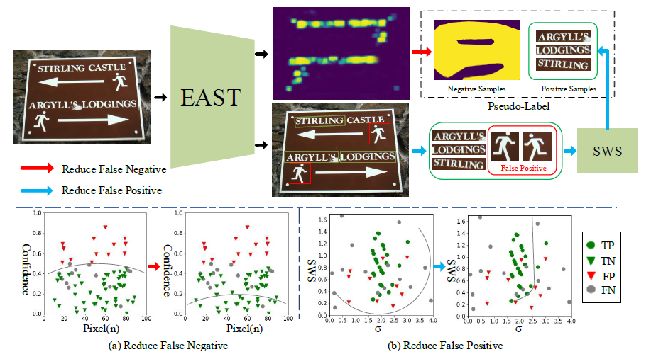

# Synthetic-to-Real-Unsupervised-Domain-Adaptation-for-Scene-Text-Detection-in-the-Wild

<div align="center">
  
</div>


### Introduction
&#160;&#160;&#160;&#160; &#160;&#160;This is a project concerning Synthetic-to-Real Unsupervised Domain
Adaptation for Scene Text Detection in the Wild

&#160;&#160;&#160;&#160; &#160;&#160;we propose a synthetic-to-real domain adaptation method for scene text detection, which transfers knowledge from synthetic data (source domain) to real data (target domain)

&#160;&#160;&#160;&#160; &#160;&#160;From more details,please refer to our arXiv paper.(TDB)

## Environments

- python 3
- torch = 1.1.0 
- torchvision
- Pillow
- numpy


## Train
The pre-trained model can be obtained from [Baidu Drive](https://pan.baidu.com/s/1f385DFGUVFIWnPBmAA2Ljw) password: n74a

Before taining the model, you need to configure related parameters:
```
resume
target_pseudo_negative
target_pseudo_positive
target_image
path_save

```

Our experiments are based on one machine with 2 2080ti(16g memory).

```
python trainSyndataToICDAR15.py
```

## Eval
for example (batchsize=2)
```
CUDA_VISIBLE_DEVICES=0 python -u eval.py 
```

## License

For academic use, this project is licensed under the Apache License - see the LICENSE file for details. For commercial use, please contact the authors. 

## Citations
Please consider citing our paper in your publications if the project helps your research.


Eamil: weijia_wu@yeah.net